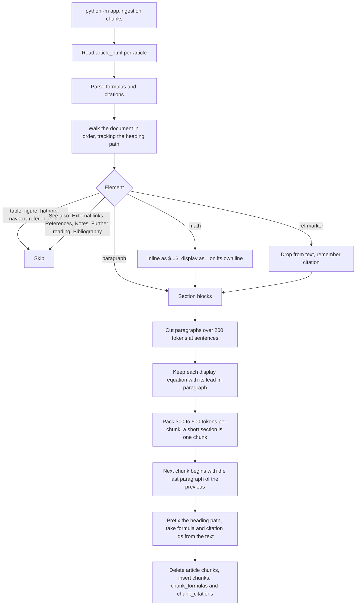

# Ingestion: chunks

```mermaid
flowchart TD
    A[python -m app.ingestion chunks] --> B[Read article_html per article]
    B --> C[Parse formulas and citations]
    C --> D[Walk the document in order, tracking the heading path]
    D --> E{Element}
    E -- table, figure, hatnote, navbox, references list --> F[Skip]
    E -- See also, External links, References, Notes, Further reading, Bibliography --> F
    E -- math --> G[Inline as $...$, display as $$...$$ on its own line]
    E -- ref marker --> H[Drop from text, remember citation]
    E -- paragraph --> I[Section blocks]
    G --> I
    H --> I
    I --> J[Cut paragraphs over 200 tokens at sentences]
    J --> K[Keep each display equation with its lead-in paragraph]
    K --> L[Pack 300 to 500 tokens per chunk, a short section is one chunk]
    L --> M[Next chunk begins with the last paragraph of the previous]
    M --> N[Prefix the heading path, take formula and citation ids from the text]
    N --> O[Delete article chunks, insert chunks, chunk_formulas and chunk_citations]
```
