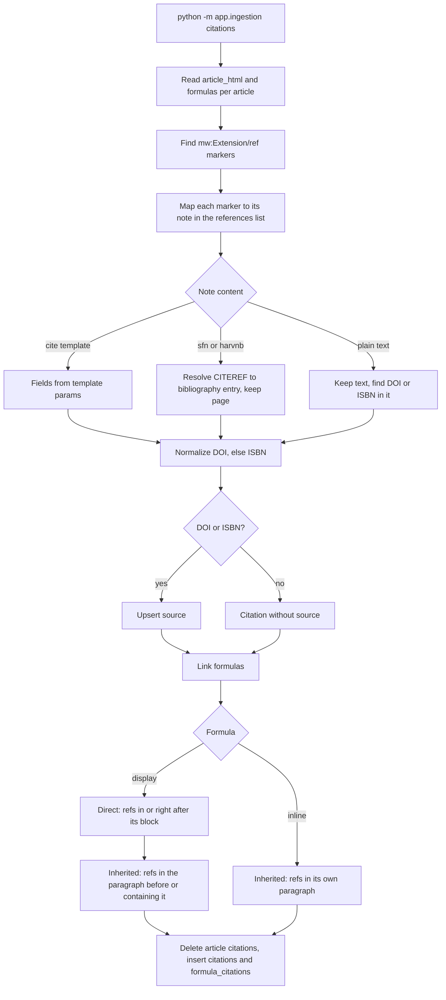

# Ingestion: citations

```mermaid
flowchart TD
    A[python -m app.ingestion citations] --> B[Read article_html and formulas per article]
    B --> C[Find mw:Extension/ref markers]
    C --> D[Map each marker to its note in the references list]
    D --> E{Note content}
    E -- cite template --> F[Fields from template params]
    E -- sfn or harvnb --> G[Resolve CITEREF to bibliography entry, keep page]
    E -- plain text --> H[Keep text, find DOI or ISBN in it]
    F --> I[Normalize DOI, else ISBN]
    G --> I
    H --> I
    I --> J{DOI or ISBN?}
    J -- yes --> K[Upsert source]
    J -- no --> L[Citation without source]
    K --> M[Link formulas]
    L --> M
    M --> N{Formula}
    N -- display --> O[Direct: refs in or right after its block]
    O --> P[Inherited: refs in the paragraph before or containing it]
    N -- inline --> Q[Inherited: refs in its own paragraph]
    P --> R[Delete article citations, insert citations and formula_citations]
    Q --> R
```
