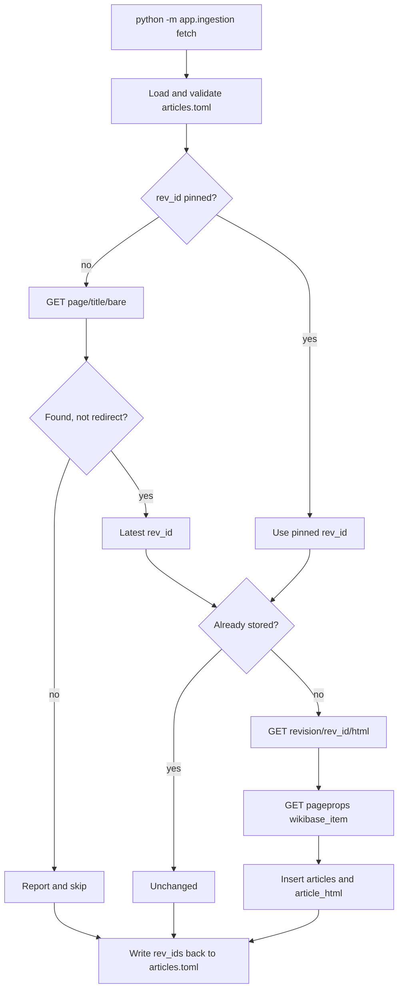

# Ingestion: fetch

```mermaid
flowchart TD
    A[python -m app.ingestion fetch] --> B[Load and validate articles.toml]
    B --> C{rev_id pinned?}
    C -- no --> D[GET page/title/bare]
    D --> E{Found, not redirect?}
    E -- no --> X[Report and skip]
    E -- yes --> F[Latest rev_id]
    C -- yes --> G[Use pinned rev_id]
    F --> H{Already stored?}
    G --> H
    H -- yes --> Z[Unchanged]
    H -- no --> I[GET revision/rev_id/html]
    I --> J[GET pageprops wikibase_item]
    J --> K[Insert articles and article_html]
    K --> L[Write rev_ids back to articles.toml]
    Z --> L
    X --> L
```
