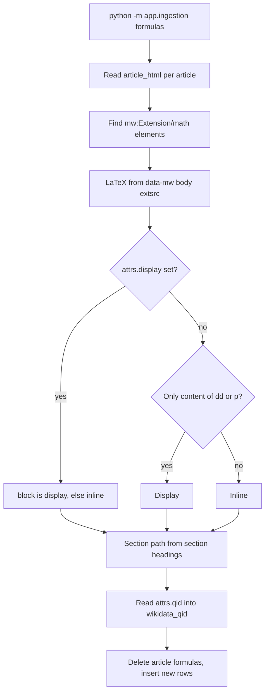

# Ingestion: formulas

```mermaid
flowchart TD
    A[python -m app.ingestion formulas] --> B[Read article_html per article]
    B --> C[Find mw:Extension/math elements]
    C --> D[LaTeX from data-mw body extsrc]
    D --> E{attrs.display set?}
    E -- yes --> F[block is display, else inline]
    E -- no --> G{Only content of dd or p?}
    G -- yes --> H[Display]
    G -- no --> I[Inline]
    F --> J[Section path from section headings]
    H --> J
    I --> J
    J --> Q[Read attrs.qid into wikidata_qid]
    Q --> K[Delete article formulas, insert new rows]
```
