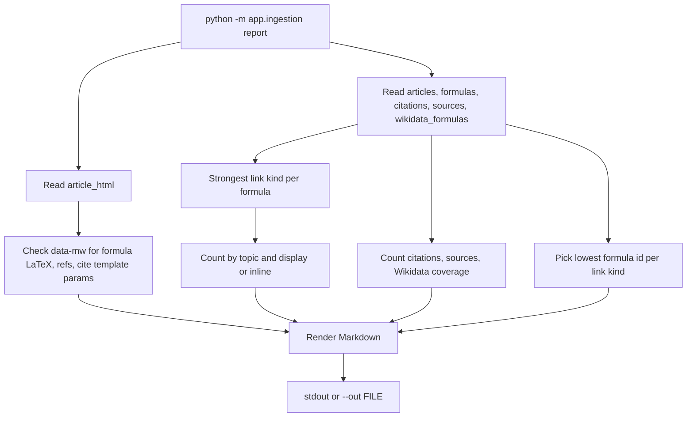

# Ingestion: report

```mermaid
flowchart TD
    A[python -m app.ingestion report] --> B[Read articles, formulas, citations, sources, wikidata_formulas]
    A --> C[Read article_html]
    C --> D[Check data-mw for formula LaTeX, refs, cite template params]
    B --> E[Strongest link kind per formula]
    E --> F[Count by topic and display or inline]
    B --> G[Count citations, sources, Wikidata coverage]
    B --> H[Pick lowest formula id per link kind]
    D --> I[Render Markdown]
    F --> I
    G --> I
    H --> I
    I --> J[stdout or --out FILE]
```
