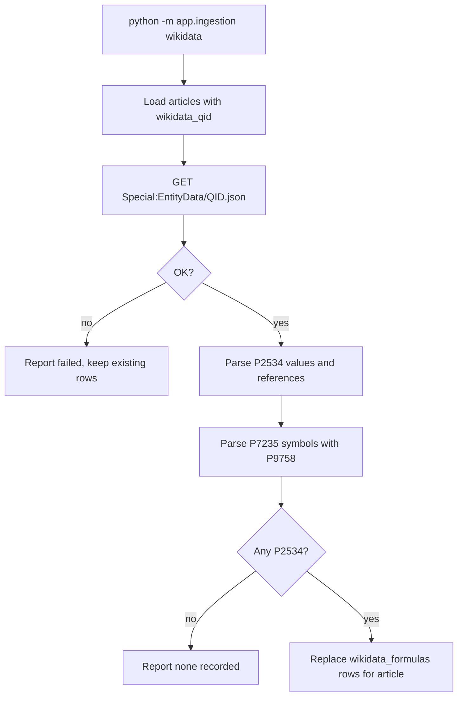

# Ingestion: Wikidata formulas

```mermaid
flowchart TD
    A[python -m app.ingestion wikidata] --> B[Load articles with wikidata_qid]
    B --> C[GET Special:EntityData/QID.json]
    C --> D{OK?}
    D -- no --> X[Report failed, keep existing rows]
    D -- yes --> E[Parse P2534 values and references]
    E --> F[Parse P7235 symbols with P9758]
    F --> G{Any P2534?}
    G -- no --> H[Report none recorded]
    G -- yes --> I[Replace wikidata_formulas rows for article]
```
