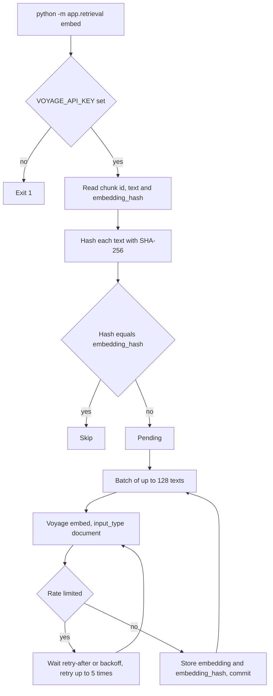

# Retrieval: embed

```mermaid
flowchart TD
    A[python -m app.retrieval embed] --> B{VOYAGE_API_KEY set}
    B -- no --> C[Exit 1]
    B -- yes --> D[Read chunk id, text and embedding_hash]
    D --> E[Hash each text with SHA-256]
    E --> F{Hash equals embedding_hash}
    F -- yes --> G[Skip]
    F -- no --> H[Pending]
    H --> I[Batch of up to 128 texts]
    I --> J[Voyage embed, input_type document]
    J --> K{Rate limited}
    K -- yes --> L[Wait retry-after or backoff, retry up to 5 times]
    L --> J
    K -- no --> M[Store embedding and embedding_hash, commit]
    M --> I
```
