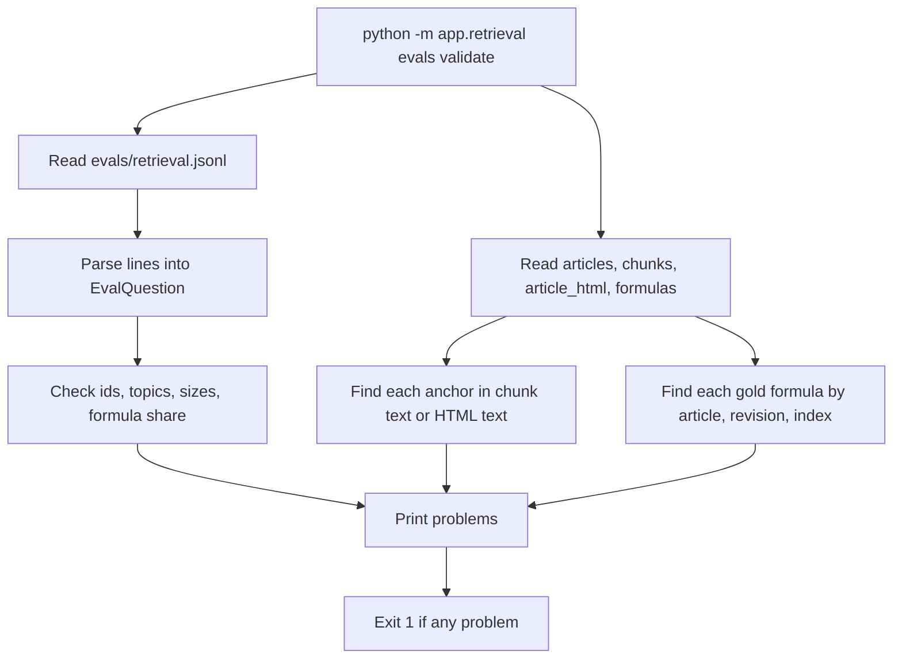

# Retrieval: evals

```mermaid
flowchart TD
    A[python -m app.retrieval evals validate] --> B[Read evals/retrieval.jsonl]
    B --> C[Parse lines into EvalQuestion]
    C --> D[Check ids, topics, sizes, formula share]
    A --> E[Read articles, chunks, article_html, formulas]
    E --> F[Find each anchor in chunk text or HTML text]
    E --> G[Find each gold formula by article, revision, index]
    D --> H[Print problems]
    F --> H
    G --> H
    H --> I[Exit 1 if any problem]
```
