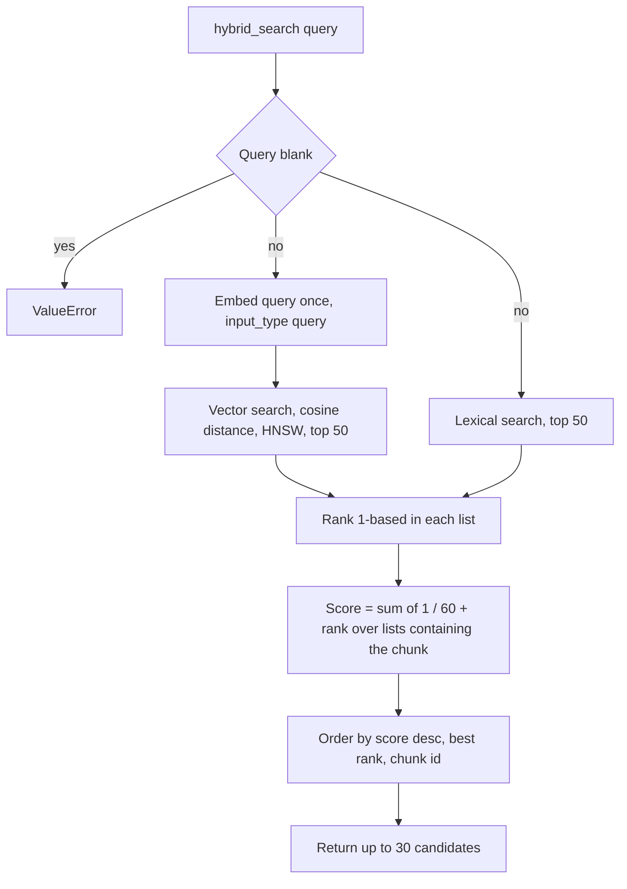

# Retrieval: hybrid

```mermaid
flowchart TD
    A[hybrid_search query] --> B{Query blank}
    B -- yes --> C[ValueError]
    B -- no --> D[Embed query once, input_type query]
    D --> E[Vector search, cosine distance, HNSW, top 50]
    B -- no --> F[Lexical search, top 50]
    E --> G[Rank 1-based in each list]
    F --> G
    G --> H[Score = sum of 1 / 60 + rank over lists containing the chunk]
    H --> I[Order by score desc, best rank, chunk id]
    I --> J[Return up to 30 candidates]
```
