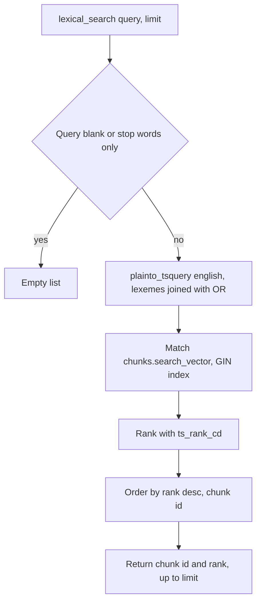

# Retrieval: lexical

```mermaid
flowchart TD
    A[lexical_search query, limit] --> B{Query blank or stop words only}
    B -- yes --> C[Empty list]
    B -- no --> D[plainto_tsquery english, lexemes joined with OR]
    D --> E[Match chunks.search_vector, GIN index]
    E --> F[Rank with ts_rank_cd]
    F --> G[Order by rank desc, chunk id]
    G --> H[Return chunk id and rank, up to limit]
```
