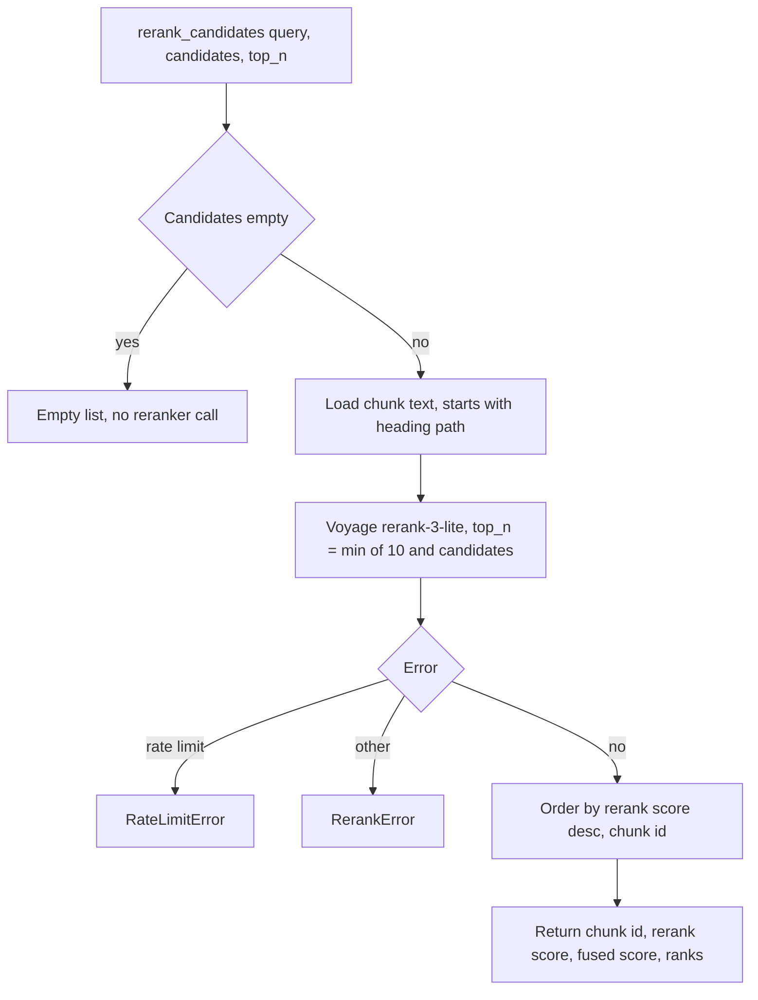

# Retrieval: rerank

```mermaid
flowchart TD
    A[rerank_candidates query, candidates, top_n] --> B{Candidates empty}
    B -- yes --> C[Empty list, no reranker call]
    B -- no --> D[Load chunk text, starts with heading path]
    D --> E[Voyage rerank-3-lite, top_n = min of 10 and candidates]
    E --> F{Error}
    F -- rate limit --> G[RateLimitError]
    F -- other --> H[RerankError]
    F -- no --> I[Order by rerank score desc, chunk id]
    I --> J[Return chunk id, rerank score, fused score, ranks]
```
