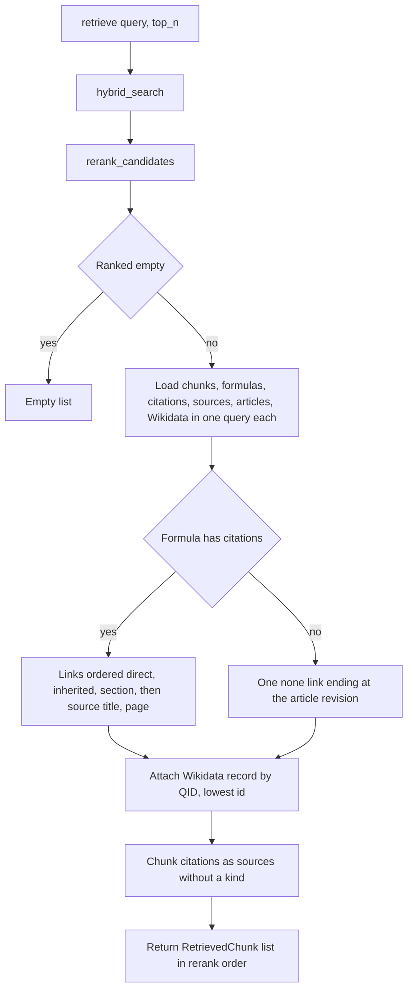

# Retrieval: results

```mermaid
flowchart TD
    A[retrieve query, top_n] --> B[hybrid_search]
    B --> C[rerank_candidates]
    C --> D{Ranked empty}
    D -- yes --> E[Empty list]
    D -- no --> F[Load chunks, formulas, citations, sources, articles, Wikidata in one query each]
    F --> G{Formula has citations}
    G -- yes --> H[Links ordered direct, inherited, section, then source title, page]
    G -- no --> I[One none link ending at the article revision]
    H --> J[Attach Wikidata record by QID, lowest id]
    I --> J
    J --> K[Chunk citations as sources without a kind]
    K --> L[Return RetrievedChunk list in rerank order]
```
